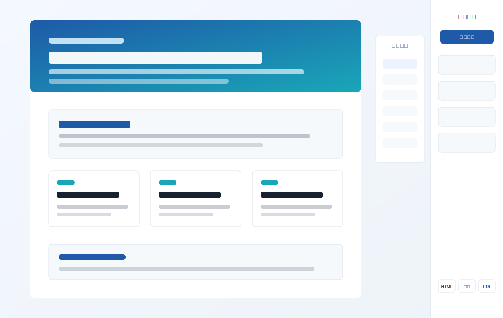
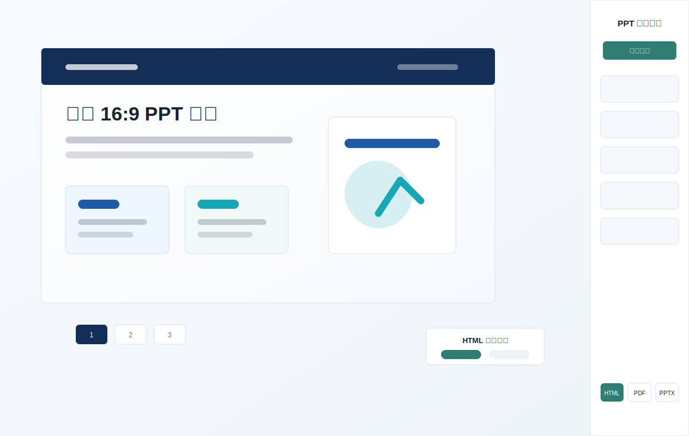

# html-report

这是一个用于生成稳定、可编辑 HTML 报告的 Codex skill。它可以把已有内容或已有 HTML 报告包装成统一的编辑壳，支持长屏单页报告和固定 16:9 的 HTML PPT，并提供右侧样式抽屉、元素级编辑、浏览器验收和点击触发导出。

## 示例效果

### 单页模式



当报告需要像网页一样纵向阅读时，使用 `single-page`。它适合审计报告、研究报告、月报、仪表盘说明页等内容，支持章节导航、自适应宽度、自动高度，以及 `HTML / 图片 / PDF` 导出。

### PPT 模式



当报告需要像演示文稿一样逐页浏览时，使用 `ppt`。它使用固定 `1440 × 810` 画布，支持页码导航、对象几何同步，以及 `HTML / PDF / PPTX` 导出。

## 这个 Skill 能做什么

- 生成带右侧样式抽屉的 HTML 报告。
- 支持全局字体、字号、行高和表格间距调整。
- 支持文本、形状、图表、图片的独立样式编辑。
- 支持颜色控件和 HEX 文本输入，例如粘贴 `#1E5AA8`。
- 单页模式提供章节导航；PPT 模式提供页面导航。
- 图表区域兼容 ECharts resize。
- HTML 导出可选择 `保留编辑` 或 `仅查看`。
- 通过本地预览服务，在用户点击后生成图片、PDF 或 PPTX。

## 快速开始

准备一个带有明确 `mode` 的 `model.json`，然后选择对应模板构建。

```bash
python scripts/build_html_report_from_model.py model.json \
  --template assets/template/html-report-single-base.html \
  --out output/index.html
```

运行验收检查：

```bash
python scripts/check_html_report.py output/index.html
node scripts/qa_html_report.mjs output/index.html
node scripts/qa_editor_enhancements.mjs output/index.html
node scripts/qa_preview_export.mjs output/index.html
```

启动本地预览服务，在浏览器中点击导出按钮：

```bash
node scripts/start_html_report_preview.mjs output 5300
```

## 从 GitHub 安装

这个仓库已经公开，其他用户可以把 GitHub 地址交给 Codex，直接安装 skill：

```text
$skill-installer install from https://github.com/Lucas-Fong/html-report-stable-base
```

如果安装器要求填写 repo path，使用仓库根目录即可，因为 `SKILL.md` 就在根目录。

为了提高 GitHub 搜索命中率，仓库已设置 `codex`、`codex-skills`、`openai-codex`、`agent-skills`、`html-report`、`report-generator` 等 topic。

## 作为 Codex Plugin 安装

这个仓库现在已经包含 `.codex-plugin/plugin.json`，因此也可以作为 Codex plugin 分发。plugin 通过 `skills/html-report/SKILL.md` 暴露同一个 `html-report` skill，模板、脚本、references、fixtures 和示例图仍保留在仓库根目录统一维护。

当你希望它在 Codex 中拥有插件卡片、默认 prompt、元信息和 marketplace 分发能力时，使用 plugin 方式比单纯安装 skill 更合适。

## 如何被 Codex 发现

公开 GitHub 仓库不会自动进入 Codex 的 curated skill 列表。想要在 Codex 中更容易被浏览和发现，需要把这个 plugin 加入 marketplace source。marketplace 可以是个人、团队或公开来源，取决于使用环境。

这个仓库已经具备 plugin manifest，下一步就是把它加入目标 marketplace。

短期分发：

- 分享这个 GitHub 仓库地址。
- 让用户通过 `$skill-installer` 从 GitHub 安装。
- 保持 README、topic 和示例图清晰，方便 GitHub 搜索。

插件分发：

- 分享这个 GitHub URL 作为 plugin source。
- 把 plugin 加入个人、团队或公开 marketplace source。
- 持续维护 `.codex-plugin/plugin.json` 中的元信息、默认 prompt、关键词、截图和 README 示例。

## 最小模型示例

### 单页模式

```json
{
  "mode": "single-page",
  "title": "市场审计报告",
  "sections": [
    {
      "id": "summary",
      "title": "核心摘要",
      "html": "<h1 class=\"editable\" data-editable-element=\"text\">核心摘要</h1><p class=\"editable\" data-editable-element=\"text\">...</p>"
    }
  ]
}
```

### PPT 模式

```json
{
  "mode": "ppt",
  "title": "策略汇报",
  "slides": [
    {
      "title": "第 1 页",
      "html": "<h1 class=\"editable\" data-editable-element=\"text\">第 1 页</h1>",
      "objects": []
    }
  ]
}
```

## 可编辑元素标记

每个需要独立编辑的元素必须声明且只声明一种类型。

```html
<h2 class="editable" data-editable-element="text">标题</h2>
<div data-editable-element="shape">卡片</div>
<div class="chart" data-editable-element="chart"></div>

```

## 目录结构

- `SKILL.md`：完整 skill 契约和工作流。
- `.codex-plugin/plugin.json`：Codex plugin 元信息，用于插件发现和 marketplace 分发。
- `skills/html-report/`：插件侧的 skill 入口。
- `assets/examples/`：README 和 skill 文档中使用的示例图。
- `assets/template/`：单页和 PPT 模板，以及共享编辑器资源。
- `fixtures/`：编辑器验收用例。
- `references/`：补充契约，例如抽屉和元素编辑规则。
- `scripts/`：构建器、检查脚本、浏览器 QA、预览服务和导出工具。

## 版本管理建议

建议纳入版本管理的内容：源文件、模板、fixtures、示例图、脚本、references 和 lockfile。

不要提交：`node_modules/`、生成的导出文件、本地报告输出、临时 QA 产物。
